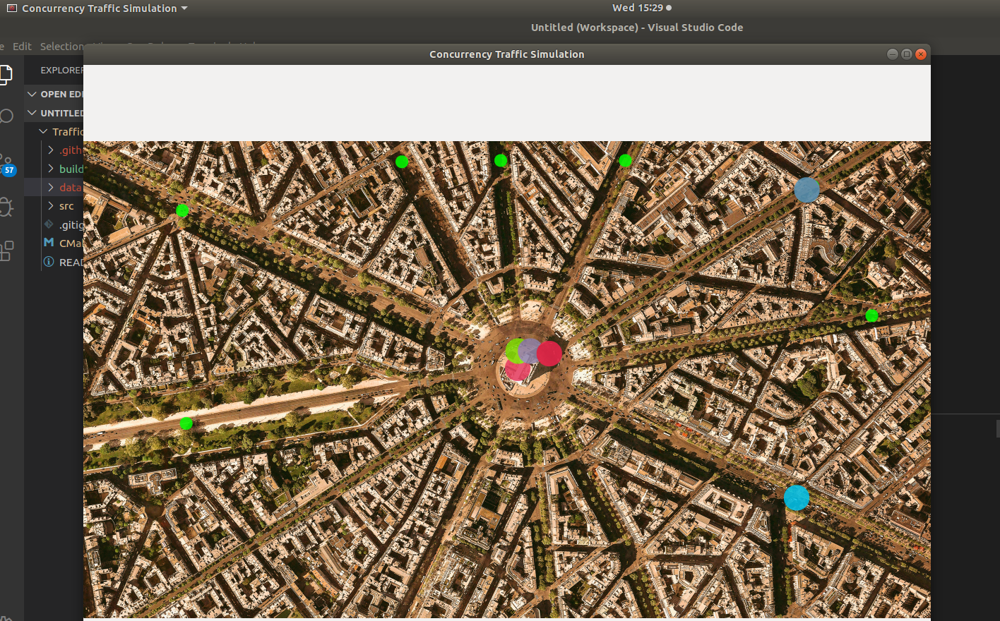

# Traffic-Simulator

Simulates the typical day-today traffic using threads , Implemented in a way which handles effecient movement towards the intersections and made use of Traffic Lights for a clean Traffic Flow.



## Run the following to Install

```
1. git clone https://github.com/nandakishore323/All/tree/master/Traffic-Simul/Traffic-Simulator
2. mkdir build && cd build
3. cmake ..
4. make
5. ./traffic_simulation
```

