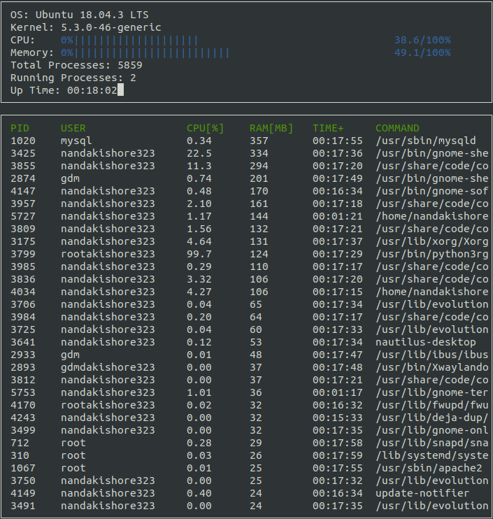

# hTop-Clone

A hTop like application , returns the status of the system , also the information of all the running processes and some of the specific process information



## Run the following to Install

```
1. git clone https://github.com/nandakishore323/All/tree/master/hTop-clone
2. make build
3. ./build/monitor
```
